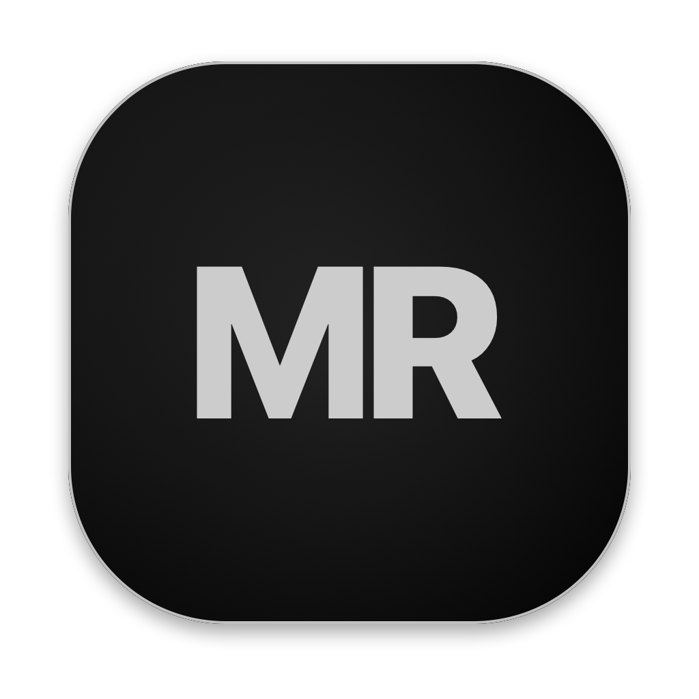

  

<h1 align="center">MacRunner</h1>

<strong>Your Windows apps. Your Mac.</strong>

A native macOS app for bringing Windows software to Apple Silicon.

  <a href="#the-experience">The experience</a> ·
  <a href="#progress">Progress</a> ·
  <a href="https://github.com/t0b1kent/macrunner-app/issues/1">Vote for the next title</a> ·
  <a href="RELEASE_STATUS.md">Release status</a> ·
  <a href="CREDITS.md">Credits</a>

---

MacRunner is built around a simple idea: **choose an app or game, add it to your library, and launch it from one familiar Mac interface.** The application brings together the runtime, graphics components, settings, and diagnostics needed to make that experience possible.

**Currently in local preview.** The native app has been built for local testing. End-to-end game launching is still being validated; public downloads and automatic update delivery are being prepared. Compatibility depends on the app and the engine version.

## The experience

| 1 · Choose | 2 · Add | 3 · Launch |
| --- | --- | --- |
| Pick the Windows app or game you want to use. | Keep your games and apps together in one library. | Start it from the app and follow its status in one place. |

### People, tools & foundations

| Project | AI development assistance | Special thanks | Runtime & graphics |
| --- | --- | --- | --- |
| [t0b1kent](https://github.com/t0b1kent) | **Claude · Codex** | **Jev** | **Wine · FEX · DXMT · Metal** |

MacRunner is made possible by these people, tools, and the many upstream contributors whose work it builds on. **[Full credits and acknowledgements →](CREDITS.md)**

### Made to feel at home on macOS

- **A native interface.** Built with SwiftUI, with a library, settings, and diagnostic tools inside a regular Mac app.
- **One place for your software.** Find your games and apps together in your MacRunner library.
- **A complete bundle.** The app, runtime, and graphics components are packaged as one matched version.
- **Updates designed to stay in sync.** The update system is being prepared to deliver that complete bundle through MacRunner.
- **12 interface languages.** Localization resources are included and checked for consistency.

## Progress

| Milestone | What it means |
| --- | --- |
| **Native Mac app** | Local preview 1.0.2 builds and packages successfully. |
| **74 automated checks** | Application and packaging checks pass, including update coordination and recovery. |
| **45,998 shaders** | The separate DirectX 12 development path passes native loading and parsing/reflection checks for this shader corpus. |
| **27 targeted GPU frames** | Geometry-shader tests pass, including indexed drawing. These are controlled tests, not full game validation. |

### Current focus: Elden Ring

Current optimization work focuses on **Elden Ring**, including rendering correctness, pipeline integration, and performance. DirectX 12 has reached shader-loading and targeted GPU-validation milestones. **Ray-tracing research** has also passed isolated shadow/radiance and acceleration-structure tests; full in-game DXR remains in development.

These graphics results belong to a separate development branch. The current app bundle uses an experimental **Wine/FEX/DXMT path for 64-bit Direct3D 10/11**. Individual games still need their own compatibility checks. [Read the exact scope of each milestone →](RELEASE_STATUS.md)

**Full 32-bit Windows support is still in development.** Apple Developer account approval is also pending. Account approval alone will not complete 32-bit implementation or compatibility testing.

## How it works

| Part of a Windows program | Path to your Mac |
| --- | --- |
| CPU instructions | Windows x86-64 → FEX translation → Apple Silicon CPU |
| Windows system calls and APIs | Wine → macOS |
| Direct3D 10/11 graphics in the current bundle | DXMT → Metal → Apple GPU |

**Metal is the native graphics backend.** Windows APIs, CPU instructions, and shaders still need translation. The separate DirectX 12 development path also targets Metal; it is not included in the current preview bundle.

## Availability

MacRunner is intended for **Macs with Apple Silicon**. The interface targets **macOS 14 or later**; validation of the complete runtime on supported macOS versions is part of release preparation.

There is no public installer yet. This repository is the project's public presentation and progress page; application source code and binaries are not included here.

Next: validate the complete app workflow, prepare signed distribution, and test real updates between installed versions. [See what's ready and what's next →](RELEASE_STATUS.md)

## Help choose what's next

Elden Ring is the current focus. Help choose which **games and apps to optimize next**: add a 👍 reaction to an existing title, or suggest one title per comment.

**[Vote or suggest a title →](https://github.com/t0b1kent/macrunner-app/issues/1)**

A vote guides priorities; it is not a promise of compatibility or a release date.

## Development Mac

The current primary development and test machine is:

| | |
| --- | --- |
| Mac | MacBook Pro |
| Chip | Apple M1 Pro |
| CPU | 8 cores · 6 performance + 2 efficiency |
| GPU | 14 cores |
| Unified memory | 32 GB |
| Operating system | macOS 27.0 · build 26A428 |

This is the machine used for current development, not a minimum specification or certification of other Macs.

## Built with a lot of help

MacRunner builds on the work of **Wine, FEX, DXMT**, and the many projects that support them. Development has been assisted by **Claude** and **Codex**. Special thanks to **Jev**.

We want the people and projects behind this work to be visible. [Meet the foundations and acknowledgements →](CREDITS.md)

---

Independent project · Experimental preview · Updated September 23, 2026

