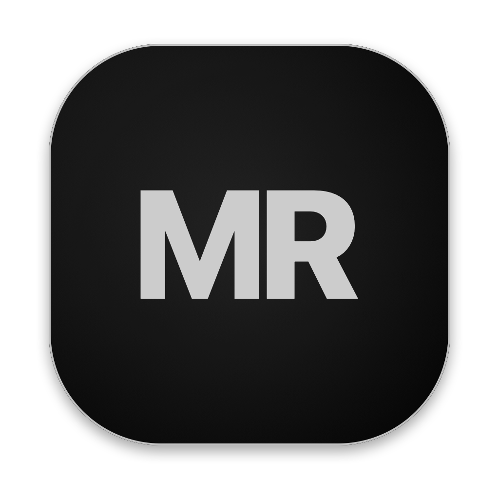

  

<h1 align="center">MacRunner</h1>

<strong>Your Windows apps. Your Mac.</strong>

A native Mac app. HyperBridge, an x86 → ARM64 engine built on FEX-Emu, for Apple Silicon.

  <a href="#the-experience">The experience</a> ·
  <a href="HYPERBRIDGE.md">HyperBridge engine</a> ·
  <a href="#tested-games--engines">Tested games &amp; engines</a> ·
  <a href="#progress">Progress</a> ·
  <a href="https://github.com/t0b1kent/macrunner-app/issues/1">Vote for the next title</a> ·
  <a href="RELEASE_STATUS.md">Release status</a> ·
  <a href="#contributors--credits">Contributors &amp; credits</a>

---

MacRunner is built around a simple idea: **choose an app or game, add it to your library, and launch it from one familiar Mac interface.** The application brings together the runtime, graphics components, settings, and diagnostics needed to make that experience possible.

**HyperBridge is MacRunner's CPU engine:** an **x86-64 / x86 → ARM64 engine for Windows software on Apple Silicon**, built on [FEX-Emu](https://github.com/FEX-Emu/FEX) with MacRunner's own patch series. Its source is public under MIT at [t0b1kent/hyperbridge](https://github.com/t0b1kent/hyperbridge). Wine provides Windows API compatibility, and Metal handles graphics through the relevant translation components. [Explore the engine, its current scope and roadmap →](HYPERBRIDGE.md)

**Development preview: [MacRunner 1.0.6](https://github.com/t0b1kent/macrunner-app/releases/tag/v1.0.6), October 1, 2026**, with the FEX-based HyperBridge series 0001–0026, for Apple Silicon Macs with macOS 27.0. This release is signed ad hoc and not notarized. The game results below retain their original test dates and configurations. [Changes since 1.0.3 and current limits →](RELEASE_STATUS.md)

A separate [1.0.6-indiana experimental preview](https://github.com/t0b1kent/macrunner-app/releases/tag/v1.0.6-indiana) adds Indiana Jones and the Great Circle (GOG) through MoltenVK. Its M1 Pro check reported about 10–12 FPS at minimum settings, with rendering issues and a GPU hang that restarted the macOS session when firing a weapon. Save your work before trying it. This is separate from the ordinary 1.0.6 bundle. [Test scope →](TESTED_GAMES.md#indiana-jones--106-indiana-experimental-preview)

## Tested games & engines

**Test Mac:** MacBook Pro · **Apple M1 Pro** (8-core CPU / 14-core GPU) · **32 GB unified memory** · **macOS 27.0**. [Full machine details below.](#development-mac)

**Hollow Knight reached its main menu on the 1.0.6 engine (October 1).** Its gameplay and FPS results below remain the September 29 checks on 1.0.3; neither was re-verified for 1.0.6. The other rows are earlier runtime results that establish MacRunner's development baseline. The game engine is the technology the game itself was built with; the graphics column shows the path used during each check. [Exact test configurations →](TESTED_GAMES.md)

| Game | Game engine | Graphics path | Recorded result | FPS |
| --- | --- | --- | --- | --- |
| **Hollow Knight** | Unity | DXMT → Metal | **Working on 1.0.3 (HyperBridge)** | **107–117** at a 120 Hz limit |
| **Divinity: Original Sin — Enhanced Edition** | Divinity Engine | DXMT → Metal | **Working** | **100** |
| **Factorio** | Custom engine (Wube) | DXMT → Metal | **Working** | Not measured |
| **Vampire Survivors** | Unity (IL2CPP) | DXMT → Metal | **Working** | Not measured |
| **Hedon Bloodrite** | GZDoom | OpenGL → Metal (Apple driver) | **Working** | Not measured |
| **DOOM 64** | KEX (PC re-release) | OpenGL → Metal (Apple driver) | **Working** | Not measured |
| **Ion Fury** | Build / EDuke32 | Software rendering | **Working** | Not measured |
| **Dome Keeper** | Godot | OpenGL → Metal (Apple driver) | **Working** | Not measured |
| **WRATH: Aeon of Ruin** | DarkPlaces (Quake-derived) | OpenGL → Metal (Apple driver) | **Working** | Not measured |
| **Elden Ring** | FromSoftware in-house engine | DXMT-based DirectX 12 → Metal | **Working** | Not measured |

**OpenGL → Metal** means the game uses OpenGL through Wine and Apple's Metal-backed OpenGL driver on the test Mac. This is a separate path from DXMT and D3DMetal. [How to read the graphics paths →](TESTED_GAMES.md#reading-the-graphics-paths)

**Working** means gameplay works in the tested configuration. Hollow Knight was checked on MacRunner 1.0.3 with HyperBridge engine 0015 on September 29; the other rows record checks of specific development configurations. **[Test dates, verified functions and remaining issues →](TESTED_GAMES.md)**

**Hollow Knight's FPS was measured** on September 29, 2026 (1280×720, V-Sync on, King's Pass, Metal HUD log; [details](TESTED_GAMES.md#macrunner-103--hyperbridge-engine-0015)). **The other FPS values are maintainer-reported gameplay observations on the test Mac**, reported on September 24, 2026; resolution, graphics settings, scene and sample duration have not yet been recorded for them. “Not measured” means a result is still pending, not zero FPS.

**Why these games?** Together they exercise Unity, Godot, custom engines and Doom/Build/Quake-derived technology, across Direct3D 11, Direct3D 12, OpenGL and software rendering. This variety helps find issues shared by different kinds of games. Results remain title-specific. [Game engines and test coverage →](TESTED_GAMES.md#game-engines--test-coverage)

## Contributors & credits

| Person, tool or project | Role |
| --- | --- |
| **[t0b1kent](https://github.com/t0b1kent)** | Project creator and maintainer |
| **Jev** | Special thanks |
| **Claude · Anthropic** | AI assistance during development |
| **Codex · OpenAI** | AI assistance during development, review and validation |
| **Wine contributors** | Windows API compatibility |
| **HyperBridge** | MacRunner's CPU engine: FEX-Emu with MacRunner's patch series ([source](https://github.com/t0b1kent/hyperbridge)) |
| **FEX-Emu contributors** | The x86 → ARM64 emulator HyperBridge is built on |
| **DXMT contributors** | Direct3D 10/11 translation to Metal |
| **MacRunner DirectX 12 development** | DXMT-based DirectX 12 → Metal integration, shader and runtime work; [Elden Ring gameplay confirmed by the maintainer](TESTED_GAMES.md#elden-ring--tested--working) |
| **Apple Metal, Swift and SwiftUI teams** | Native graphics and application foundations |
| **All other upstream authors and maintainers** | [Dependency acknowledgements, component provenance and earlier runtime credits](CREDITS.md) |

These credits recognise people, development tools and upstream projects. GitHub's sidebar separately lists authors of commits to this public presentation repository. Acknowledgements do not imply affiliation or endorsement.

## The experience

| 1 · Choose | 2 · Add | 3 · Launch |
| --- | --- | --- |
| Pick the Windows app or game you want to use. | Keep your games and apps together in one library. | Start it from the app and follow its status in one place. |

### Made to feel at home on macOS

- **A native interface.** Built with SwiftUI, with a library, settings, and diagnostic tools inside a regular Mac app.
- **One place for your software.** Find your games and apps together in your MacRunner library.
- **A complete bundle.** The app, the Windows runtime, the HyperBridge engine and the graphics components ship together.
- **Updates designed to stay in sync.** The update system is being prepared to deliver that complete bundle through MacRunner.
- **12 interface languages.** Localization resources are included and checked for consistency.

## Progress

| Milestone | What it means |
| --- | --- |
| **HyperBridge series 0001–0026** | The CPU engine recipe in MacRunner 1.0.6 (October 1). The comparison on the [HyperBridge page](https://github.com/t0b1kent/hyperbridge) still describes the September 29 builds. |
| **Native Mac app** | Development preview 1.0.6 released with the corresponding source of its LGPL/GPL components. |
| **Compatibility fixes since 1.0.3** | 1.0.4 fixes a Wine-server mapping failure; 1.0.5 exposes crypto CPU features and fixes L3 reporting and executable loading; 1.0.6 updates exception handling, the x18 transition path and Hedon's graphics profile. [Release details →](RELEASE_STATUS.md) |
| **Automated application checks** | Launch status, installation, localization, packaging and update coordination are covered by passing checks. |
| **45,998 shaders** | The separate DirectX 12 development path passes native loading and parsing/reflection checks for this shader corpus. |
| **27 targeted GPU frames** | Geometry-shader tests pass, including indexed drawing. These are controlled tests, not full game validation. |

### Current focus: game checks and graphics

**Game checks on HyperBridge.** Hollow Knight reached its main menu on the 1.0.6 engine on October 1; gameplay and FPS were not re-verified for this build. The earlier gameplay results retain their tested configurations. Startup, gameplay, saving and clean exit require title-specific checks. Engine performance work is tracked on the [HyperBridge page](https://github.com/t0b1kent/hyperbridge).

**Elden Ring remains a graphics-development focus.** DirectX 12 gameplay was confirmed by the maintainer on the earlier development configuration. Graphics work has also reached shader-loading and targeted GPU-validation milestones. **Ray tracing is experimental, not released.** These results do not establish the same game's operation on the current HyperBridge bundle. [Read the scope of each milestone →](RELEASE_STATUS.md)

**Windows x64 remains the released integration focus.** On October 1, Heroes III reached its main menu on our Developer ID-signed Wine loader. A rare crash after the menu remains open; this 32-bit work is in development and is not in 1.0.6. Native Windows ARM64 application support requires separate Wine validation. [Host and Windows architectures →](HYPERBRIDGE.md#host-and-windows-architectures)

**Signing preparation, October 2:** the Apple Developer account was approved on October 1. Our Developer ID provisioning profile carries Apple's cross-architecture-support entitlement, and a native probe succeeds. Apple accepted a trial notarization of our Developer ID-signed Wine loader on October 2. These changes are being prepared for the next release; they do not change 1.0.6's ad hoc signature. Integration of hardware memory ordering into the engine continues, with no speed result yet.

## How we test

Three offline stands help check a candidate before a game run. As of October 2, the CPU stand has checked 500,595 of 540,861 saved states from five titles; the 32-bit stand's first stage uses 616 states from four titles at two address-space bases; the graphics stand replays selected Direct3D 11 frames without Wine. They expose specific defects and reference gaps, and do not certify whole-game compatibility or FPS. [Results, controls and coverage limits →](RELEASE_STATUS.md#how-we-test)

## How it works

**Architecture of the ordinary MacRunner 1.0.6 preview (October 1):**

| Part of a Windows program | Path to your Mac |
| --- | --- |
| CPU instructions | Windows x86-64 → HyperBridge → ARM64 instructions on Apple Silicon |
| Windows system calls and APIs | Wine → macOS |
| Direct3D 10/11 graphics | DXMT → Metal → Apple GPU |
| DirectX 12 graphics development | MacRunner's DXMT-based DirectX 12 path → Metal → Apple GPU |

HyperBridge handles **CPU translation**; Wine and the graphics components perform different jobs. **Metal is the native graphics backend.** Windows APIs, CPU instructions, and shaders still need translation. The separate DirectX 12 development path is not included in the current preview bundle. [Engine boundaries and integration status →](HYPERBRIDGE.md)

## Availability

MacRunner is intended for **Macs with Apple Silicon**. The current development bundle contains libraries that require **macOS 27.0**. A broader supported macOS range and launch on Macs with standard security settings have not yet been validated.

**HyperBridge's source is public under MIT** at [t0b1kent/hyperbridge](https://github.com/t0b1kent/hyperbridge). This repository contains the project presentation, [engine license information](HYPERBRIDGE_LICENSE.md), progress reports and the app's [releases](https://github.com/t0b1kent/macrunner-app/releases); the application source is not published here. MacRunner 1.0.6 is a development preview: signed ad hoc, not notarized, automatic updates off.

Next: validate the prepared signed loader in the complete app, repeat game checks and validate real updates. [HyperBridge →](https://github.com/t0b1kent/hyperbridge) · [App release status →](RELEASE_STATUS.md)

## Help choose what's next

Help choose which **games and apps to validate and optimize on HyperBridge next**: add a 👍 reaction to an existing title, or suggest one title per comment. Elden Ring remains a graphics-development priority.

**[Vote or suggest a title →](https://github.com/t0b1kent/macrunner-app/issues/1)**

A vote guides priorities; it is not a promise of compatibility or a release date.

## Development Mac

The current primary development and test machine is:

| | |
| --- | --- |
| Mac | MacBook Pro |
| Chip | Apple M1 Pro |
| CPU | 8 cores · 6 performance + 2 efficiency |
| GPU | 14 cores |
| Unified memory | 32 GB |
| Operating system | macOS 27.0.1 · build 26A434 (October 2); September 29 benchmarks used 27.0 · 26A428 |

This is the machine used for current development, not a minimum specification or certification of other Macs.

## Built with a lot of help

MacRunner develops **HyperBridge**, built on **FEX-Emu**, alongside its integration with **Wine, DXMT and Metal**. Supporting libraries and earlier development foundations are acknowledged in the full credits. Development has been assisted by **Claude** and **Codex**. Special thanks to **Jev**.

We want the people and projects behind this work to be visible. [Meet the foundations and acknowledgements →](CREDITS.md)

---

HyperBridge engine (FEX-Emu based, MIT) · MacRunner 1.0.6 development preview · Updated October 2, 2026

